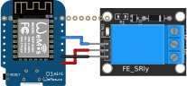
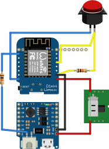

# wireless-estop
This project realizes a wireless E-Stop. It will handle the state of the actual button and also handle connection losses. 

The reaction time is configurable. 

## ESP-NOW! Connection
The client is a Wemos D1 Mini with an attached battery shield and a 1000mAh battery connected to it. Additionally a "Normally Closed" E-Stop button button is wired to an input pin. 

The master is also a Wemos D1 that is connected to a relay switch. The state of the E-Stop button is mirrored to the relay switch. 

The state of the button is sent to the master in a given frequency via ESP-NOW! protocol. 

There are two causes that can set the system to stopped state. 
 * The button is pressed (connection is open)
 * The master does not receive a message within a given time frame (timeout)

If the master does not receive a message within a given time it will assume the connection is lost and switch to STOP state. 

## Schematics Base Station
The base station can be pretty much anything. In the example the E-stop button state is mirrored to a relay. It should be wired 'normally closed' and when the E-Stop button is free (not pressed, D2 pin = HIGH) the connection of the relay is closed. 

Base station wired to relay

## Schematics E-Stop Button Station
The button station is powered via the Wemos D1 battery shield connected to a 1000mAh lipo battery. It can be turned on or off via the main switch and charged through the battery shield. 

The E-Stop button itself is wired to the D2 pin as an input. 

E-Stop Station

## Configuration
In **common/config.h** the system can be configured. The cell id should be adapted to avoid issues with projects compiled in standard configuration. 

## Building
The projects can be built using Visual Studio Code with PlatformIO extension. 
You might have to adapt the upload_port and monitor_port in platformio.ini to match your serial connection. 